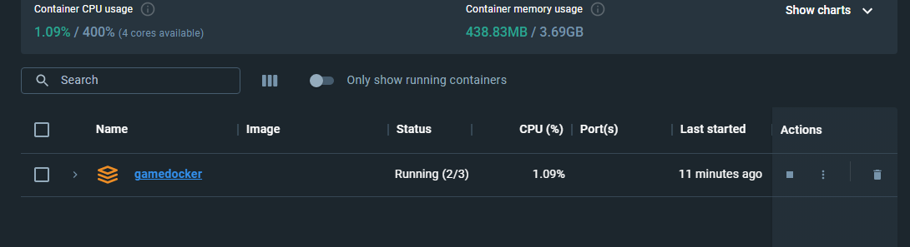
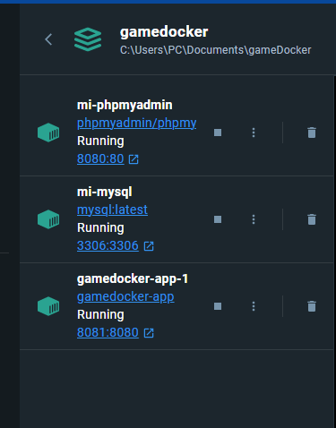
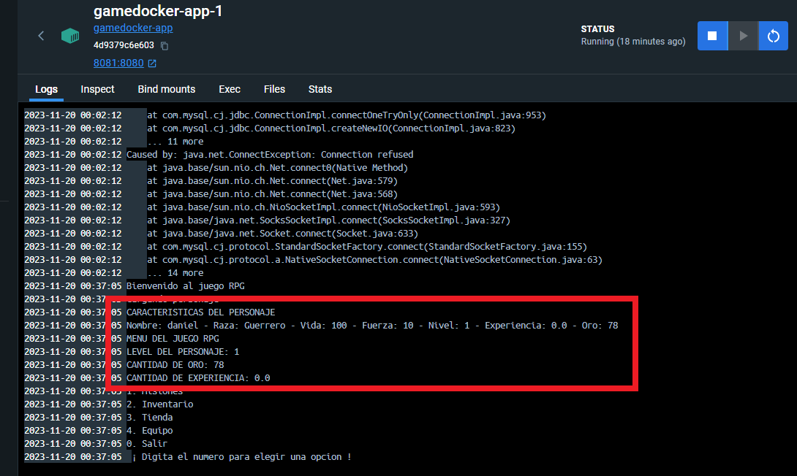

# DockerFile Example Java Gradlew and Mysql with PHPMyAdmin 

Para mi Poryecto final En la materia Sistemas Distribuidos Estructure un contenedor Docker que compila un Juego rpg hecho en consola. Este sistema se conecta a una base de datos.

El Contendor de docker-compose posee tres Servicios:

 Dockerfile que posee el JAR de javaJDK17 con gradlew , base de datos MySQL y gestor PHPMyAdmin.

## Install

Asegúrate de tener instalado JDK17 y Docker.

Clona el Repositorio.

```bash
git clone https://github.com/JEYBAN37/gameDocker.git
cd gameDocker
```
Ejecuta en el bash el Comando.
```bash
docker-compose up
```
Ve al Docker y el contenedor se tiene que ver de esta manera 



El contenedor debe tener activo los dos servicios de base de datos mi-mysql y mi-phpmyAdmin.


ingresa al servicio mi-phpmyAdmin para agregar el archivo .sql que se encuentra en la carpeta "scriptBD" llamado "game.sql" estas son las credenciales.

USER
```bash
root
```

PASSWORD
```bash
notSecure
```

Ingresa y crea una base de datos llamada "game" importas el scritp, si no sabes como te dejo este link https://help.one.com/hc/es/articles/115005588189--C%C3%B3mo-importar-una-base-de-datos-a-phpMyAdmin-
se tiene que ver de esta manera.


una vez cargada la base de datos ve al bash y ejecuta este comando para crear un contenedor interactivo y probar el juego. 

```bash
docker-compose run -it app
```
## Verificacion de funcionamiento

verifica que el contenedor principal este activo y de color verde.



ve al contenedor llamado gamedocker-app-1 y observa la consola.



compara los atributos del personaje que se muestran en pantalla con lo que se muestran en la tabla "personage" de la base de datos y verifica si el funcionamiento es correcto.


